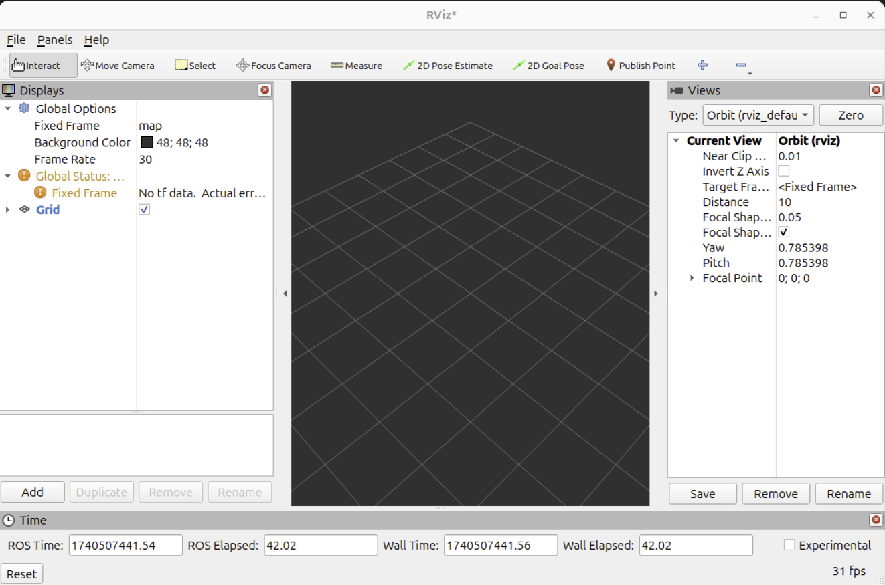
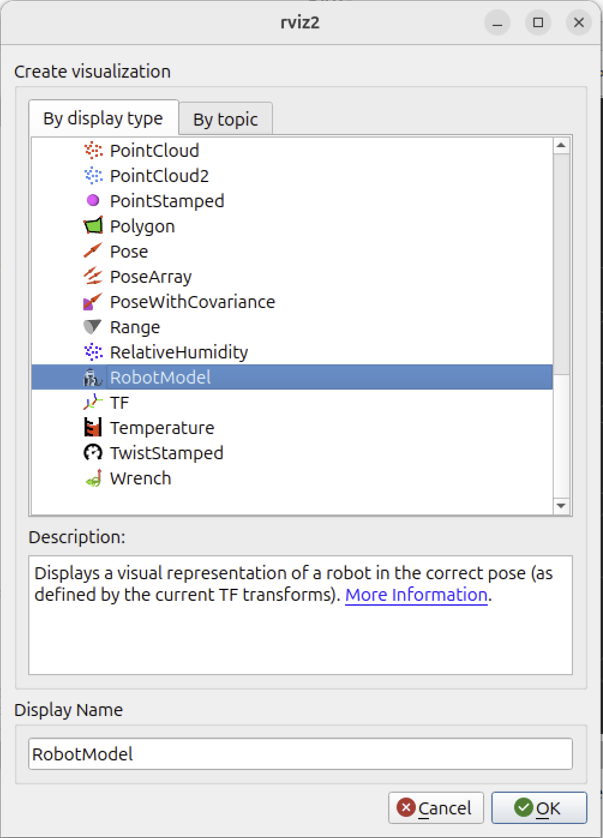
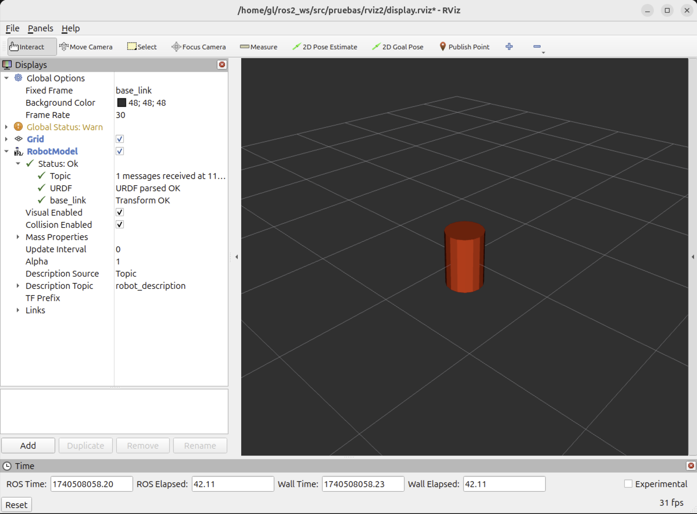
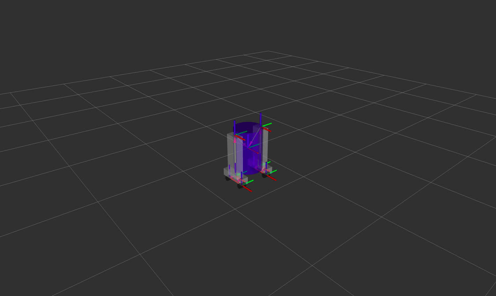

# Basic ROS2 jazzy Tutorial

***Author: Dr. Francesco Garcia-Luna***

---

## Index

1. [Installation](#1-installation)
    - [Setup Sources](#11-setup-sources)
    - [Install ROS2 packages](#12-install-ros2-packages)
    - [Environment Setup](#13-environment-setup)
    - [ROS Domain ID](#14-ros-domain-id)
    - [ROS Localhost only](#15-ros-localhost-only)
    - [Colcon](#16-colcon)
    - [(Optional) Uninstall ROS2](#optional-uninstall-ros2)
2. [Create a ROS2 Workspace](#2-create-a-ros2-workspace)
3. [Create a ROS2 Package](#3-create-a-ros2-package)
    - [Build the ROS2 Package](#31-build-the-ros2-package)
4. [Write a Publisher Node](#4-write-a-publisher-node)
    - [Add dependencies to the package](#41-add-dependencies-to-the-package)
    - [Add an entrypoint](#42-add-an-entrypoint)
5. [Write a Subscriber Node](#5-write-a-subscriber-node)
    - [Add an entrypoint](#52-add-an-entrypoint)
6. [Run the ROS2 Nodes](#6-run-the-ros2-nodes)
7. [Create a Basic URDF Model](#7-create-a-basic-urdf-model)
    - [Visualize the URDF Model in RVIZ2](#71-visualize-the-urdf-model-in-rviz2)
8. [Create a Basic Launch File to visualize the URDF Model](#8-create-a-basic-launch-file-to-visualize-the-urdf-model)
9. [Create a Multishape Model](#9-create-a-multishape-model)
    - [Create a launch file to visualize the URDF model in RVIZ2](#91-create-a-launch-file-to-visualize-the-urdf-model-in-rviz2)
    - [Origins in URDF](#92-origins-in-urdf)
    - [Materials in URDF](#93-materials-in-urdf)
    - [Example of a Multishape Model](#94-example-of-a-multishape-model)

---

## 1. Installation

For detailed installation instructions, please refer to the [ROS2 jazzy Installation Guide](https://docs.ros.org/en/jazzy/Installation.html).

### 1.1. Setup Sources

```sh
sudo apt install software-properties-common
sudo add-apt-repository universe
sudo apt update && sudo apt install curl -y
sudo curl -sSL https://raw.githubusercontent.com/ros/rosdistro/master/ros.key -o /usr/share/keyrings/ros-archive-keyring.gpg
echo "deb [arch=$(dpkg --print-architecture) signed-by=/usr/share/keyrings/ros-archive-keyring.gpg] http://packages.ros.org/ros2/ubuntu $(. /etc/os-release && echo $UBUNTU_CODENAME) main" | sudo tee /etc/apt/sources.list.d/ros2.list > /dev/null
```

### 1.2. Install ROS2 packages

```sh
sudo apt update
sudo apt upgrade -y
sudo apt install ros-jazzy-desktop-full
```

### 1.3. Environment Setup

```sh
echo "source /opt/ros/jazzy/setup.bash" >> ~/.bashrc
source ~/.bashrc
```

### 1.4. ROS Domain ID

The `ROS_DOMAIN_ID` environment variable is used to isolate ROS 2 networks. It is recommended to set it to a unique value for each network. For example, if you are running multiple ROS 2 networks on the same machine, you can set `ROS_DOMAIN_ID` to different values for each network.

```sh
echo "export ROS_DOMAIN_ID=<your_domain_id>" >> ~/.bashrc
source ~/.bashrc
```

### 1.5. ROS Localhost only

To restrict ROS 2 to use only the localhost interface, you can set the `ROS_LOCALHOST_ONLY` environment variable to `1`.

```sh
echo "export ROS_LOCALHOST_ONLY=1" >> ~/.bashrc
source ~/.bashrc
```

### 1.6. Colcon

Colcon is a command-line tool to build ROS 2 packages. You can install it using the following command:

```sh
sudo apt install python3-colcon-common-extensions
echo "source /usr/share/colcon_cd/function/colcon_cd.sh" >> ~/.bashrc
echo "export _colcon_cd_root=/opt/ros/jazzy/" >> ~/.bashrc
source ~/.bashrc
```

### (Optional) Uninstall ROS2

```sh
sudo apt remove ~nros-jazzy-* && sudo apt autoremove
sudo rm /etc/apt/sources.list.d/ros2.list
sudo apt update
sudo apt autoremove
sudo apt upgrade
```

---

## 2. Create a ROS2 Workspace


To create a new ROS 2 workspace, you can use the following commands:

```sh
mkdir -p ~/ros2_ws/src
cd ~/ros2_ws
colcon build --symlink-install
source ~/ros2_ws/install/setup.bash
```

---

## 3. Create a ROS2 Package

To create a new ROS 2 package, you can use the following command:

```sh
cd ~/ros2_ws/src
ros2 pkg create --build-type ament_cmake <package_name>
```

### 3.1. Build the ROS2 Package

To build the ROS 2 package, you can use the following command:

```sh
cd ~/ros2_ws
colcon build --symlink-install
source ~/ros2_ws/install/setup.bash
```

---

## 4. Write a Publisher Node

To write a simple publisher node, you can use the following Python code:

```python
import rclpy
from rclpy.node import Node

from std_msgs.msg import String


class MinimalPublisher(Node):

    def __init__(self):
        super().__init__('minimal_publisher')
        self.publisher_ = self.create_publisher(String, 'topic', 10)
        timer_period = 0.5  # seconds
        self.timer = self.create_timer(timer_period, self.timer_callback)
        self.i = 0

    def timer_callback(self):
        msg = String()
        msg.data = 'Hello World: %d' % self.i
        self.publisher_.publish(msg)
        self.get_logger().info('Publishing: "%s"' % msg.data)
        self.i += 1


def main(args=None):
    rclpy.init(args=args)

    minimal_publisher = MinimalPublisher()

    rclpy.spin(minimal_publisher)

    # Destroy the node explicitly
    # (optional - otherwise it will be done automatically
    # when the garbage collector destroys the node object)
    minimal_publisher.destroy_node()
    rclpy.shutdown()


if __name__ == '__main__':
    main()
```

### 4.1. Add dependencies to the package

A dependency is a package that your package depends on. To add dependencies to the ROS 2 package, you can edit the `package.xml` file in the package directory.

```xml
<exec_depend>rclpy</exec_depend>
<exec_depend>std_msgs</exec_depend>
```

### 4.2. Add an entrypoint

An entrypoint is a Python script that is executed when the package is run. To add an entrypoint to the ROS 2 package, you can edit the `setup.py` file in the package directory.

```python
entry_points={
    'console_scripts': [
        'talker = <package_name>.<script_name>:main',
    ],
},
```

---

## 5. Write a Subscriber Node

To write a simple subscriber node, you can use the following Python code:

```python
import rclpy
from rclpy.node import Node

from std_msgs.msg import String


class MinimalSubscriber(Node):

    def __init__(self):
        super().__init__('minimal_subscriber')
        self.subscription = self.create_subscription(
            String,
            'topic',
            self.listener_callback,
            10)
        self.subscription  # prevent unused variable warning

    def listener_callback(self, msg):
        self.get_logger().info('I heard: "%s"' % msg.data)


def main(args=None):
    rclpy.init(args=args)

    minimal_subscriber = MinimalSubscriber()

    rclpy.spin(minimal_subscriber)

    # Destroy the node explicitly
    # (optional - otherwise it will be done automatically
    # when the garbage collector destroys the node object)
    minimal_subscriber.destroy_node()
    rclpy.shutdown()


if __name__ == '__main__':
    main()
```

### 5.2. Add an entrypoint

To add an entrypoint to the ROS 2 package, you can edit the `setup.py` file in the package directory.

```python
entry_points={
    'console_scripts': [
        'talker = <package_name>.<script_name>:main',
        'listener = py_pubsub.subscriber_member_function:main',
    ],
},
```

---

## 6. Run the ROS2 Nodes

To run the ROS 2 nodes, you can use the following commands:

```sh
cd ~/ros2_ws
source install/setup.bash
ros2 run <package_name> <script_name>
```

---

## 7. Create a Basic URDF Model

To create a basic URDF model, you can use the following XML code:

```xml
<?xml version="1.0"?>
<robot name="myfirst">
    <link name="base_link">
        <visual>
            <geometry>
                <cylinder length="0.6" radius="0.2"/>
            </geometry>
        </visual>
    </link>
</robot>
```

It is recommended to be saved in a directory called `urdf` inside the package directory.

Also, some modifications need to be done in the `setup.py` file, by adding the following lines:

```python
import os
from glob import glob

data_files = [
    (os.path.join('share', package_name, 'urdf'), glob('urdf/*.urdf')),
]
```

---

### 7.1. Visualize the URDF Model in RVIZ2

In order to visualize an URDF Model in RVIZ2, first you need to open RVIZ2 and create a config file in the `rviz2` directory of the package.

```bash
rviz2
```



Then, you can add a `RobotModel` display by selecting the `Add` button and selecting `RobotModel`.



Change the `Fixed Frame` in the `Global Options` from `map` to `base_link`. Now, change the `Description Topic` in the `RobotModel` display to `/robot_description`.

Now, save the configuration file in the `rviz2` directory of the package by clicking on the `Save Config As` button in the `File` menu.

Finally, add the following lines to the `setup.py` file:

```python
data_files = [
    (os.path.join('share', package_name, 'rviz2'), glob('rviz2/*.rviz')),
]
```

In order to visualize the URDF Model in RVIZ2, you can use the following command:

```bash
ros2 run robot_state_publisher robot_state_publisher --ros-args -p robot_description:="$(cat src/<package_name>/urdf/<model_name>.urdf)"
```



---

## 8. Create a Basic Launch File to visualize the URDF Model

To create a basic launch file to visualize the URDF Model in RVIZ2, you can use the following XML code:

```python
import os
import launch
from launch import LaunchDescription
import launch_ros.actions

from ament_index_python.packages import get_package_share_directory

def generate_launch_description() -> LaunchDescription:
    pruebas_path: str = get_package_share_directory('<package_name>')
    urdf_filename: str = os.path.join(pruebas_path, 'urdf', '<model_name>.urdf')
    
    if not os.path.exists(urdf_filename):
            raise FileNotFoundError(f'URDF file not found at: {urdf_filename}')

    with open(urdf_filename, 'r') as infp:
        robot_description: str = infp.read()

    return LaunchDescription([
        launch_ros.actions.Node(
            package='robot_state_publisher',
            executable='robot_state_publisher',
            name='robot_state_publisher',
            output='screen',
            parameters=[{'robot_description': robot_description}]
        ),
        launch_ros.actions.Node(
            package='rviz2',
            executable='rviz2',
            name='rviz2',
            output='screen',
            arguments=['-d', os.path.join(pruebas_path, 'rviz', '<rviz_config_name>.rviz')]
        )
    ])
```

where `<model_name>` is the name of the URDF model file, and `<rviz_config_name>` is the name of the RVIZ2 configuration file, and `<package_name>` is the name of the ROS2 package. And save the file as `display.launch.py` for example, in the `launch` directory of the package.

Then, you need to add the following lines to the `setup.py` file:

```python
data_files = [
    (os.path.join('share', package_name, 'launch'), glob('launch/*.launch.py')),
]
```

And, the next lines to the `package.xml` file:

```xml
<export>
    <launch_file>display.launch.py</launch_file>
</export>
```

Finally, compile and source the workspace, and run the launch file:

```bash
colcon build --symlink-install
source install/setup.bash
ros2 launch <package_name> display.launch.py
```

---

## 9. Create a Multishape Model

First we need to add a new package called `urdf_launch` from the repository [urdf_launch](https://github.com/ros/urdf_launch.git) to the workspace, and install `ros-jazzy-joint-state-publisher-gui`:

```bash
cd ~/ros2_ws/src
git clone --recursive https://github.com/ros/urdf_launch.git
sudo apt install ros-jazzy-joint-state-publisher-gui
```

Then, compile and source the workspace

```bash
cd ~/ros2_ws
colcon build --symlink-install
source install/setup.bash
```

Now, we can create a new URDF model with multiple shapes:

```xml
<?xml version="1.0"?>
<robot name="multishapes">
    <!-- LINKS -->
    <link name="base_link">
        <visual>
            <geometry>
                <cylinder length="0.6" radius="0.2"/>
            </geometry>
        </visual>
    </link>

    <link name="right_leg">
        <visual>
            <geometry>
                <box size="0.6 0.1 0.2"/>
            </geometry>
        </visual>
    </link>

    <!-- JOINTS -->
    <joint name="base_to_right_leg" type="fixed">
        <parent link="base_link"/>
        <child link="right_leg"/>
    </joint>

</robot>
```

where the `base_link` is a cylinder and the `right_leg` is a box. Save the file as `multishapes.urdf` in the `urdf` directory of the package.

### 9.1. Create a launch file to visualize the URDF model in RVIZ2

Now, we can create a launch file to visualize the URDF model in RVIZ2:

```python
from launch import LaunchDescription
from launch.actions import DeclareLaunchArgument, IncludeLaunchDescription
from launch_ros.actions import Node
from launch.substitutions import LaunchConfiguration, PathJoinSubstitution
from launch_ros.substitutions import FindPackageShare

def generate_launch_description() -> LaunchDescription:
    ld = LaunchDescription()

    # Get the package path
    pkg_share = FindPackageShare(package='pruebas')
    
    # Build file paths
    default_model_path = PathJoinSubstitution(['urdf', 'basic.urdf'])
    default_rviz_path = PathJoinSubstitution([pkg_share, 'rviz2', 'display.rviz'])

    # Argument to enable/disable GUI
    gui_arg = DeclareLaunchArgument(
        name='gui',
        default_value='true',
        choices=['true', 'false'],
        description='Flag to enable/disable the GUI'
    )
    ld.add_action(gui_arg)

    # Argument for the RViz config file
    rviz_arg = DeclareLaunchArgument(
        name='rvizconfig',
        default_value=default_rviz_path,
        description='Path to the RViz config file relative to the package'
    )
    ld.add_action(rviz_arg)

    # Argument for the URDF model
    model_arg: DeclareLaunchArgument = DeclareLaunchArgument(
        name='model',
        default_value=default_model_path,
        description='Path to robot urdf file relative to urdf_tutorial package')
    ld.add_action(model_arg)

    # Include the urdf_launch launch
    ild: IncludeLaunchDescription = IncludeLaunchDescription(
        PathJoinSubstitution([FindPackageShare('urdf_launch'), 'launch', 'display.launch.py']),
        launch_arguments={
            'urdf_package': 'pruebas',
            'urdf_package_path': LaunchConfiguration('model'),
            'rviz_config': LaunchConfiguration('rvizconfig'),
            'jsp_gui': LaunchConfiguration('gui')}.items())
    ld.add_action(ild)

    return ld
```

Save the file as `display_custom.launch.py` in the `launch` directory of the package.

Finally, to run the launch file, compile and source the workspace, and run the launch file:

```bash
cd ~/ros2_ws
colcon build --symlink-install
source install/setup.bash
ros2 launch <package_name> display_custom.launch.py model:=urdf/<model_name>.urdf
```

### 9.2. Origins in URDF

The origins in URDF are defined by the `origin` tag, which specifies the position and orientation of the link or joint with respect to its parent. The `origin` tag has the following attributes:

- `xyz`: The position of the link or joint in the parent frame.
- `rpy`: The orientation of the link or joint in the parent frame.

For example, to define the origin of the `right_leg` link with respect to the `base_link` link, you can use the following code:

```xml
<link name="right_leg">
    <visual>
        <origin rpy="0 1.57 0" xyz="0 0 -0.3"/>
        <geometry>
            <box size="0.6 0.1 0.2"/>
        </geometry>
    </visual>
</link>

<joint name="base_to_right_leg" type="fixed">
    <origin xyz="0 -0.22 0.25"/>
    <parent link="base_link"/>
    <child link="right_leg"/>
</joint>
```

In this example, the `right_leg` link is rotated 90 degrees around the y-axis and translated 0.3 units in the z-axis with respect to the `base_link` link. The `base_to_right_leg` joint is translated 0.22 units in the y-axis and 0.25 units in the z-axis with respect to the `base_link` link.

### 9.3. Materials in URDF

Materials in URDF are defined by the `material` tag, which specifies the color and texture of the link or joint. The `material` tag has the following attributes:

- `name`: The name of the material.
- `rgba`: The color of the material in RGBA format.

For example, to define a red color material for the `right_leg` link, you can use the following code:

```xml
<material>
    <name>white</name>
    <color rgba="1 1 1 1"/>
</material>
```

Now, we can use the material in a `visualize` tag:

```xml
<link name="left_leg">
    <visual>
        <origin rpy="0 1.57 0" xyz="0 0 -0.3"/>
        <geometry>
            <box size="0.6 0.1 0.2"/>
        </geometry>
        <material name="white"/>
    </visual>
</link>
```

### 9.4. Example of a Multishape Model

```xml
<?xml version="1.0"?>
<robot name="visual">
    <!-- MATERIALS-->
    <material name="red">
        <color rgba="1 0 0 1"/>
    </material>

    <material name="green">
        <color rgba="0 1 0 1"/>
    </material>

    <material name="blue">
        <color rgba="0 0 1 1"/>
    </material>

    <material name="cyan">
        <color rgba="0 1 1 1"/>
    </material>

    <material name="magenta">
        <color rgba="1 0 1 1"/>
    </material>

    <material name="yellow">
        <color rgba="1 1 0 1"/>
    </material>

    <material name="white">
        <color rgba="1 1 1 1"/>
    </material>

    <material name="black">
        <color rgba="0 0 0 1"/>
    </material>

    <!-- LINKS -->
    <link name="base_link">
        <visual>
            <geometry>
                <cylinder length="0.6" radius="0.2"/>
            </geometry>
            <material name="blue"/>
        </visual>
    </link>

    <link name="right_leg">
        <visual>
            <origin rpy="0 1.57 0" xyz="0 0 -0.3"/>
            <geometry>
                <box size="0.6 0.1 0.2"/>
            </geometry>
            <material name="white"/>
        </visual>
    </link>

    <link name="left_leg">
        <visual>
            <origin rpy="0 1.57 0" xyz="0 0 -0.3"/>
            <geometry>
                <box size="0.6 0.1 0.2"/>
            </geometry>
            <material name="white"/>
        </visual>
    </link>

    <link name="right_base">
        <visual>
            <geometry>
                <box size="0.4 0.1 0.1"/>
            </geometry>
            <material name="white"/>
        </visual>
    </link>

    <link name="left_base">
        <visual>
            <geometry>
                <box size="0.4 0.1 0.1"/>
            </geometry>
            <material name="white"/>
        </visual>
    </link>

    <link name="front_right_wheel">
        <visual>
            <origin rpy="1.57 0 0" xyz="0 0 0"/>
            <geometry>
                <cylinder length="0.1" radius="0.035"/>
            </geometry>
            <material name="black"/>
        </visual>
    </link>

    <link name="back_right_wheel">
        <visual>
            <origin rpy="1.57 0 0" xyz="0 0 0"/>
            <geometry>
                <cylinder length="0.1" radius="0.035"/>
            </geometry>
            <material name="black"/>
        </visual>
    </link>

    <link name="front_left_wheel">
        <visual>
            <origin rpy="1.57 0 0" xyz="0 0 0"/>
            <geometry>
                <cylinder length="0.1" radius="0.035"/>
            </geometry>
            <material name="black"/>
        </visual>
    </link>

    <link name="back_left_wheel">
        <visual>
            <origin rpy="1.57 0 0" xyz="0 0 0"/>
            <geometry>
                <cylinder length="0.1" radius="0.035"/>
            </geometry>
            <material name="black"/>
        </visual>
    </link>

    <link name="head">
        <visual>
            <geometry>
                <sphere radius="0.2"/>
            </geometry>
            <material name="white"/>
        </visual>
    </link>

    <!-- JOINTS -->
    <joint name="base_to_right_leg" type="fixed">
        <origin xyz="0 -0.22 0.25"/>
        <parent link="base_link"/>
        <child link="right_leg"/>
    </joint>

    <joint name="base_to_left_leg" type="fixed">
        <origin xyz="0 0.22 0.25"/>
        <parent link="base_link"/>
        <child link="left_leg"/>
    </joint>

    <joint name="right_base_joint" type="fixed">
        <parent link="right_leg"/>
        <child link="right_base"/>
        <origin xyz="0 0 -0.6"/>
    </joint>

    <joint name="left_base_joint" type="fixed">
        <parent link="left_leg"/>
        <child link="left_base"/>
        <origin xyz="0 0 -0.6"/>
    </joint>

    <joint name="front_right_wheel_joint" type="fixed">
        <parent link="right_base"/>
        <child link="front_right_wheel"/>
        <origin rpy="0 0 0" xyz="0.133 0 -0.085"/>
    </joint>

    <joint name="back_right_wheel_joint" type="fixed">
        <parent link="right_base"/>
        <child link="back_right_wheel"/>
        <origin rpy="0 0 0" xyz="-0.133 0 -0.085"/>
    </joint>

    <joint name="front_left_wheel_joint" type="fixed">
        <parent link="left_base"/>
        <child link="front_left_wheel"/>
        <origin rpy="0 0 0" xyz="0.133 0 -0.085"/>
    </joint>

    <joint name="back_left_wheel_joint" type="fixed">
        <parent link="left_base"/>
        <child link="back_left_wheel"/>
        <origin rpy="0 0 0" xyz="-0.133 0 -0.085"/>
    </joint>

    <joint name="head_swivel" type="continuous">
        <parent link="base_link"/>
        <child link="head"/>
        <axis xyz="0 0 1"/>
        <origin xyz="0 0 0.3"/>
    </joint>

</robot>
```



---

## 10. Move the Robot Model

To visualize and control this model run the following command:

```bash
ros2 launch <package_name> display.launch.py
```

As you move the sliders around in the `Joint State Publisher GUI`, you will see the robot model moving in RVIZ2. This is done by parsing the URDF and finding all the non-fixed joints and their limits, and then creating a slider for each joint. The `Joint State Publisher GUI` will publish the joint states to the `/joint_states` topic, which is subscribed by the `Robot State Publisher` node to update the robot model in RVIZ2.

---

## ROS2 Architecture

ROS2 is a middleware framework for robotics, providing tools and libraries for building complex robot software. It uses DDS (Data Distribution Service) for communication, supports multiple programming languages (Python, C++), and emphasizes real-time performance, security, and cross-platform compatibility. Key components include nodes, topics, services, actions, and parameters.

## Advanced Node Example

### Service Server

```python
import rclpy
from rclpy.node import Node
from example_interfaces.srv import AddTwoInts

class MinimalService(Node):
    def __init__(self):
        super().__init__('minimal_service')
        self.srv = self.create_service(AddTwoInts, 'add_two_ints', self.add_two_ints_callback)

    def add_two_ints_callback(self, request, response):
        response.sum = request.a + request.b
        self.get_logger().info(f'Incoming request: {request.a} + {request.b} = {response.sum}')
        return response

def main(args=None):
    rclpy.init(args=args)
    minimal_service = MinimalService()
    rclpy.spin(minimal_service)
    rclpy.shutdown()

if __name__ == '__main__':
    main()
```

This example shows a service that adds two integers, demonstrating synchronous communication.

### Action Client

```python
import rclpy
from rclpy.action import ActionClient
from rclpy.node import Node
from example_interfaces.action import Fibonacci

class MinimalActionClient(Node):
    def __init__(self):
        super().__init__('minimal_action_client')
        self._action_client = ActionClient(self, Fibonacci, 'fibonacci')

    def send_goal(self, order):
        goal_msg = Fibonacci.Goal()
        goal_msg.order = order
        self._action_client.wait_for_server()
        self._send_goal_future = self._action_client.send_goal_async(goal_msg)

def main(args=None):
    rclpy.init(args=args)
    action_client = MinimalActionClient()
    action_client.send_goal(10)
    rclpy.spin(action_client)

if __name__ == '__main__':
    main()
```

This demonstrates asynchronous actions for long-running tasks.

---

## 11. Conclusion

This tutorial has covered the basics of ROS2 jazzy installation, workspace creation, package development, writing publisher and subscriber nodes, and creating URDF models for visualization in RVIZ2. For more advanced topics, refer to the official ROS2 documentation.