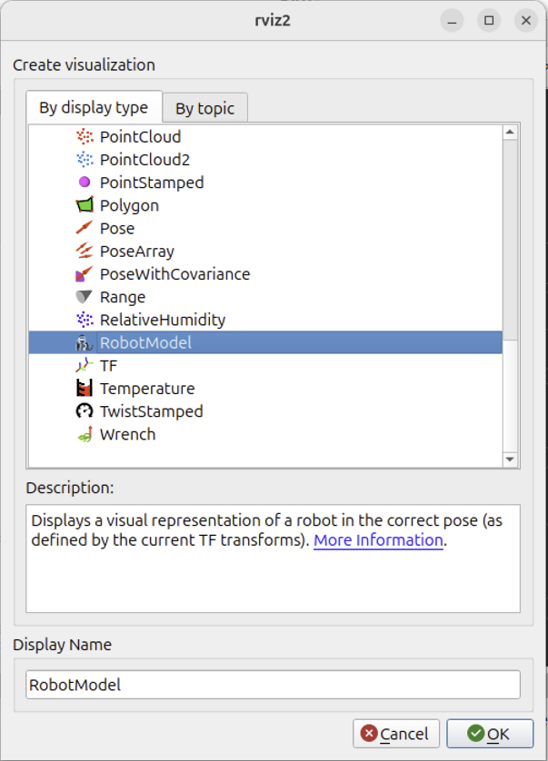

# Tutorial básico de ROS2 jazzy

***Autor: Dr. Francesco Garcia-Luna***

---

## Índice

1. [Instalación](#1-instalacion)
    - [Configurar fuentes](#11-configurar-fuentes)
    - [Instalar paquetes de ROS2](#12-instalar-paquetes-de-ros2)
    - [Configurar entorno](#13-configurar-entorno)
    - [ID de Dominio ROS](#14-id-de-dominio-ros)
    - [Solo localhost en ROS](#15-solo-localhost-en-ros)
    - [Colcon](#16-colcon)
    - [(Opcional) Desinstalar ROS2](#opcional-desinstalar-ros2)
2. [Crear un espacio de trabajo ROS2](#2-crear-un-espacio-de-trabajo-ros2)
3. [Crear un paquete ROS2](#3-crear-un-paquete-ros2)
    - [Compilar el paquete ROS2](#31-compilar-el-paquete-ros2)
4. [Escribir un nodo publicador](#4-escribir-un-nodo-publicador)
    - [Agregar dependencias al paquete](#41-agregar-dependencias-al-paquete)
    - [Agregar un entrypoint](#42-agregar-un-entrypoint)
5. [Escribir un nodo suscriptor](#5-escribir-un-nodo-suscriptor)
    - [Agregar un entrypoint](#52-agregar-un-entrypoint)
6. [Ejecutar los nodos ROS2](#6-ejecutar-los-nodos-ros2)
7. [Crear un modelo URDF básico](#7-crear-un-modelo-urdf-basico)
    - [Visualizar el modelo URDF en RVIZ2](#71-visualizar-el-modelo-urdf-en-rviz2)
8. [Crear un archivo de lanzamiento básico para visualizar el modelo URDF](#8-crear-un-archivo-de-lanzamiento-basico-para-visualizar-el-modelo-urdf)
9. [Crear un modelo multiforma](#9-crear-un-modelo-multiforma)
    - [Crear un archivo de lanzamiento para visualizar el modelo URDF en RVIZ2](#91-crear-un-archivo-de-lanzamiento-para-visualizar-el-modelo-urdf-en-rviz2)
    - [Orígenes en URDF](#92-origenes-en-urdf)
    - [Materiales en URDF](#93-materiales-en-urdf)
    - [Ejemplo de un modelo multiforma](#94-ejemplo-de-un-modelo-multiforma)

---

## 1. Instalación

Para instrucciones detalladas de instalación, consulta la [Guía de Instalación de ROS2 jazzy](https://docs.ros.org/en/jazzy/Installation.html).

### 1.1. Configurar fuentes

```sh
sudo apt install software-properties-common
sudo add-apt-repository universe
sudo apt update && sudo apt install curl -y
sudo curl -sSL https://raw.githubusercontent.com/ros/rosdistro/master/ros.key -o /usr/share/keyrings/ros-archive-keyring.gpg
echo "deb [arch=$(dpkg --print-architecture) signed-by=/usr/share/keyrings/ros-archive-keyring.gpg] http://packages.ros.org/ros2/ubuntu $(. /etc/os-release && echo $UBUNTU_CODENAME) main" | sudo tee /etc/apt/sources.list.d/ros2.list > /dev/null
```

### 1.2. Instalar paquetes de ROS2

```sh
sudo apt update
sudo apt upgrade -y
sudo apt install ros-jazzy-desktop-full
```

### 1.3. Configurar entorno

```sh
echo "source /opt/ros/jazzy/setup.bash" >> ~/.bashrc
source ~/.bashrc
```

### 1.4. ID de Dominio ROS

La variable de entorno `ROS_DOMAIN_ID` se utiliza para aislar redes ROS 2. Se recomienda establecer un valor único para cada red. Por ejemplo, si estás ejecutando múltiples redes ROS 2 en la misma máquina, puedes establecer `ROS_DOMAIN_ID` a diferentes valores para cada red.

```sh
echo "export ROS_DOMAIN_ID=<your_domain_id>" >> ~/.bashrc
source ~/.bashrc
```

### 1.5. Solo localhost en ROS

Para restringir a ROS 2 a usar solo la interfaz de localhost, puedes establecer la variable de entorno `ROS_LOCALHOST_ONLY` a `1`.

```sh
echo "export ROS_LOCALHOST_ONLY=1" >> ~/.bashrc
source ~/.bashrc
```

### 1.6. Colcon

Colcon es una herramienta de línea de comandos para construir paquetes ROS 2. Puedes instalarlo usando el siguiente comando:

```sh
sudo apt install python3-colcon-common-extensions
echo "source /usr/share/colcon_cd/function/colcon_cd.sh" >> ~/.bashrc
echo "export _colcon_cd_root=/opt/ros/jazzy/" >> ~/.bashrc
source ~/.bashrc
```

### (Opcional) Desinstalar ROS2

```sh
sudo apt remove ~nros-jazzy-* && sudo apt autoremove
sudo rm /etc/apt/sources.list.d/ros2.list
sudo apt update
sudo apt autoremove
sudo apt upgrade
```

---

## 2. Crear un espacio de trabajo ROS2


Para crear un nuevo espacio de trabajo ROS 2, puedes usar los siguientes comandos:

```sh
mkdir -p ~/ros2_ws/src
cd ~/ros2_ws
colcon build --symlink-install
source ~/ros2_ws/install/setup.bash
```

---

## 3. Crear un paquete ROS2

Para crear un nuevo paquete ROS 2, puedes usar el siguiente comando:

```sh
cd ~/ros2_ws/src
ros2 pkg create --build-type ament_cmake <package_name>
```

### 3.1. Compilar el paquete ROS2

Para compilar el paquete ROS 2, puedes usar el siguiente comando:

```sh
cd ~/ros2_ws
colcon build --symlink-install
source ~/ros2_ws/install/setup.bash
```

---

## 4. Escribir un nodo publicador

Para escribir un nodo publicador simple, puedes usar el siguiente código en Python:

```python
import rclpy
from rclpy.node import Node

from std_msgs.msg import String


class MinimalPublisher(Node):

    def __init__(self):
        super().__init__('minimal_publisher')
        self.publisher_ = self.create_publisher(String, 'topic', 10)
        timer_period = 0.5  # seconds
        self.timer = self.create_timer(timer_period, self.timer_callback)
        self.i = 0

    def timer_callback(self):
        msg = String()
        msg.data = 'Hello World: %d' % self.i
        self.publisher_.publish(msg)
        self.get_logger().info('Publishing: "%s"' % msg.data)
        self.i += 1


def main(args=None):
    rclpy.init(args=args)

    minimal_publisher = MinimalPublisher()

    rclpy.spin(minimal_publisher)

    # Destroy the node explicitly
    # (optional - otherwise it will be done automatically
    # when the garbage collector destroys the node object)
    minimal_publisher.destroy_node()
    rclpy.shutdown()


if __name__ == '__main__':
    main()
```

### 4.1. Agregar dependencias al paquete

Una dependencia es un paquete del que depende tu paquete. Para agregar dependencias al paquete ROS 2, puedes editar el archivo `package.xml` en el directorio del paquete.

```xml
<exec_depend>rclpy</exec_depend>
<exec_depend>std_msgs</exec_depend>
```

### 4.2. Agregar un entrypoint

Un entrypoint es un script de Python que se ejecuta cuando se ejecuta el paquete. Para agregar un entrypoint al paquete ROS 2, puedes editar el archivo `setup.py` en el directorio del paquete.

```python
entry_points={
    'console_scripts': [
        'talker = <package_name>.<script_name>:main',
    ],
},
```

---

## 5. Escribir un nodo suscriptor

Para escribir un nodo suscriptor simple, puedes usar el siguiente código en Python:

```python
import rclpy
from rclpy.node import Node

from std_msgs.msg import String


class MinimalSubscriber(Node):

    def __init__(self):
        super().__init__('minimal_subscriber')
        self.subscription = self.create_subscription(
            String,
            'topic',
            self.listener_callback,
            10)
        self.subscription  # prevent unused variable warning

    def listener_callback(self, msg):
        self.get_logger().info('I heard: "%s"' % msg.data)


def main(args=None):
    rclpy.init(args=args)

    minimal_subscriber = MinimalSubscriber()

    rclpy.spin(minimal_subscriber)

    # Destroy the node explicitly
    # (optional - otherwise it will be done automatically
    # when the garbage collector destroys the node object)
    minimal_subscriber.destroy_node()
    rclpy.shutdown()


if __name__ == '__main__':
    main()
```

### 5.2. Agregar un entrypoint

Para agregar un entrypoint al paquete ROS 2, puedes editar el archivo `setup.py` en el directorio del paquete.

```python
entry_points={
    'console_scripts': [
        'talker = <package_name>.<script_name>:main',
        'listener = py_pubsub.subscriber_member_function:main',
    ],
},
```

---

## 6. Ejecutar los nodos ROS2

Para ejecutar los nodos ROS 2, puedes usar los siguientes comandos:

```sh
cd ~/ros2_ws
source install/setup.bash
ros2 run <package_name> <script_name>
```

---

## 7. Crear un modelo URDF básico

Para crear un modelo URDF básico, puedes usar el siguiente código XML:

```xml
<?xml version="1.0"?>
<robot name="myfirst">
    <link name="base_link">
        <visual>
            <geometry>
                <cylinder length="0.6" radius="0.2"/>
            </geometry>
        </visual>
    </link>
</robot>
```

Se recomienda guardar en un directorio llamado `urdf` dentro del directorio del paquete.

Además, se deben realizar algunas modificaciones en el archivo `setup.py`, agregando las siguientes líneas:

```python
import os
from glob import glob

data_files = [
    (os.path.join('share', package_name, 'urdf'), glob('urdf/*.urdf')),
]
```

---

### 7.1. Visualizar el modelo URDF en RVIZ2

Para visualizar un modelo URDF en RVIZ2, primero debes abrir RVIZ2 y crear un archivo de configuración en el directorio `rviz2` del paquete.

```bash
rviz2
```


Luego, puedes agregar una visualización `RobotModel` seleccionando el botón `Add` y luego `RobotModel`.



Cambia el `Fixed Frame` en las `Global Options` de `map` a `base_link`. Ahora, cambia el `Description Topic` en la visualización `RobotModel` a `/robot_description`.

Ahora, guarda el archivo de configuración en el directorio `rviz2` del paquete haciendo clic en el botón `Save Config As` en el menú `File`.

Finalmente, agrega las siguientes líneas al archivo `setup.py`:

```python
data_files = [
    (os.path.join('share', package_name, 'rviz2'), glob('rviz2/*.rviz')),
]
```

Para visualizar el modelo URDF en RVIZ2, puedes usar el siguiente comando:

```bash
ros2 run robot_state_publisher robot_state_publisher --ros-args -p robot_description:="$(cat src/<package_name>/urdf/<model_name>.urdf)"
```


---

## 8. Crear un archivo de lanzamiento básico para visualizar el modelo URDF

Para crear un archivo de lanzamiento básico para visualizar el modelo URDF en RVIZ2, puedes usar el siguiente código XML:

```python
import os
import launch
from launch import LaunchDescription
import launch_ros.actions

from ament_index_python.packages import get_package_share_directory

def generate_launch_description() -> LaunchDescription:
    pruebas_path: str = get_package_share_directory('<package_name>')
    urdf_filename: str = os.path.join(pruebas_path, 'urdf', '<model_name>.urdf')
    
    if not os.path.exists(urdf_filename):
            raise FileNotFoundError(f'El archivo URDF no se encontró en: {urdf_filename}')

    with open(urdf_filename, 'r') as infp:
        robot_description: str = infp.read()

    return LaunchDescription([
        launch_ros.actions.Node(
            package='robot_state_publisher',
            executable='robot_state_publisher',
            name='robot_state_publisher',
            output='screen',
            parameters=[{'robot_description': robot_description}]
        ),
        launch_ros.actions.Node(
            package='rviz2',
            executable='rviz2',
            name='rviz2',
            output='screen',
            arguments=['-d', os.path.join(pruebas_path, 'rviz', '<rviz_config_name>.rviz')]
        )
    ])
```

donde `<model_name>` es el nombre del archivo del modelo URDF, y `<rviz_config_name>` es el nombre del archivo de configuración de RVIZ2, y `<package_name>` es el nombre del paquete ROS2. Y guarda el archivo como `display.launch.py`, por ejemplo, en el directorio `launch` del paquete.

Luego, necesitas agregar las siguientes líneas al archivo `setup.py`:

```python
data_files = [
    (os.path.join('share', package_name, 'launch'), glob('launch/*.launch.py')),
]
```

Y, las siguientes líneas al archivo `package.xml`:

```xml
<export>
    <launch_file>display.launch.py</launch_file>
</export>
```

Finalmente, compila y configura el espacio de trabajo, y ejecuta el archivo de lanzamiento:

```bash
colcon build --symlink-install
source install/setup.bash
ros2 launch <package_name> display.launch.py
```

---

## 9. Crear un modelo multiforma

Primero necesitamos agregar un nuevo paquete llamado `urdf_launch` del repositorio [urdf_launch](https://github.com/ros/urdf_launch.git) al espacio de trabajo, e instalar `ros-jazzy-joint-state-publisher-gui`:

```bash
cd ~/ros2_ws/src
git clone --recursive https://github.com/ros/urdf_launch.git
sudo apt install ros-jazzy-joint-state-publisher-gui
```

Luego, compila y configura el espacio de trabajo

```bash
cd ~/ros2_ws
colcon build --symlink-install
source install/setup.bash
```

Ahora, podemos crear un nuevo modelo URDF con múltiples formas:

```xml
<?xml version="1.0"?>
<robot name="multishapes">
    <!-- LINKS -->
    <link name="base_link">
        <visual>
            <geometry>
                <cylinder length="0.6" radius="0.2"/>
            </geometry>
        </visual>
    </link>

    <link name="right_leg">
        <visual>
            <geometry>
                <box size="0.6 0.1 0.2"/>
            </geometry>
        </visual>
    </link>

    <!-- JOINTS -->
    <joint name="base_to_right_leg" type="fixed">
        <parent link="base_link"/>
        <child link="right_leg"/>
    </joint>

</robot>
```

donde `base_link` es un cilindro y `right_leg` es una caja. Guarda el archivo como `multishapes.urdf` en el directorio `urdf` del paquete.

### 9.1. Crear un archivo de lanzamiento para visualizar el modelo URDF en RVIZ2

Ahora, podemos crear un archivo de lanzamiento para visualizar el modelo URDF en RVIZ2:

```python
from launch import LaunchDescription
from launch.actions import DeclareLaunchArgument, IncludeLaunchDescription
from launch_ros.actions import Node
from launch.substitutions import LaunchConfiguration, PathJoinSubstitution
from launch_ros.substitutions import FindPackageShare

def generate_launch_description() -> LaunchDescription:
    ld = LaunchDescription()

    # Obtener la ruta del paquete
    pkg_share = FindPackageShare(package='pruebas')
    
    # Construir rutas de archivos
    default_model_path = PathJoinSubstitution(['urdf', 'basic.urdf'])
    default_rviz_path = PathJoinSubstitution([pkg_share, 'rviz2', 'display.rviz'])

    # Argumento para habilitar/deshabilitar GUI
    gui_arg = DeclareLaunchArgument(
        name='gui',
        default_value='true',
        choices=['true', 'false'],
        description='Flag to enable/disable the GUI'
    )
    ld.add_action(gui_arg)

    # Argumento para el archivo de configuración de RViz
    rviz_arg = DeclareLaunchArgument(
        name='rvizconfig',
        default_value=default_rviz_path,
        description='Path to the RViz config file relative to the package'
    )
    ld.add_action(rviz_arg)

    # Argumento para el modelo URDF
    model_arg: DeclareLaunchArgument = DeclareLaunchArgument(
        name='model',
        default_value=default_model_path,
        description='Path to robot urdf file relative to urdf_tutorial package')
    ld.add_action(model_arg)

    # Incluir el lanzamiento de urdf_launch
    ild: IncludeLaunchDescription = IncludeLaunchDescription(
        PathJoinSubstitution([FindPackageShare('urdf_launch'), 'launch', 'display.launch.py']),
        launch_arguments={
            'urdf_package': 'pruebas',
            'urdf_package_path': LaunchConfiguration('model'),
            'rviz_config': LaunchConfiguration('rvizconfig'),
            'jsp_gui': LaunchConfiguration('gui')}.items())
    ld.add_action(ild)

    return ld
```

Guarda el archivo como `display_custom.launch.py` en el directorio `launch` del paquete.

Finalmente, para ejecutar el archivo de lanzamiento, compila y configura el espacio de trabajo, y ejecuta el archivo de lanzamiento:

```bash
cd ~/ros2_ws
colcon build --symlink-install
source install/setup.bash
ros2 launch <package_name> display_custom.launch.py model:=urdf/<model_name>.urdf
```

### 9.2. Orígenes en URDF

Los orígenes en URDF se definen mediante la etiqueta `origin`, que especifica la posición y orientación del enlace o junta con respecto a su padre. La etiqueta `origin` tiene los siguientes atributos:

- `xyz`: La posición del enlace o junta en el marco del padre.
- `rpy`: La orientación del enlace o junta en el marco del padre.

Por ejemplo, para definir el origen del enlace `right_leg` con respecto al enlace `base_link`, puedes usar el siguiente código:

```xml
<link name="right_leg">
    <visual>
        <origin rpy="0 1.57 0" xyz="0 0 -0.3"/>
        <geometry>
            <box size="0.6 0.1 0.2"/>
        </geometry>
    </visual>
</link>

<joint name="base_to_right_leg" type="fixed">
    <origin xyz="0 -0.22 0.25"/>
    <parent link="base_link"/>
    <child link="right_leg"/>
</joint>
```

En este ejemplo, el enlace `right_leg` está rotado 90 grados alrededor del eje y y traducido 0.3 unidades en el eje z con respecto al enlace `base_link`. La junta `base_to_right_leg` está traducida 0.22 unidades en el eje y y 0.25 unidades en el eje z con respecto al enlace `base_link`.

### 9.3. Materiales en URDF

Los materiales en URDF se definen mediante la etiqueta `material`, que especifica el color y la textura del enlace o junta. La etiqueta `material` tiene los siguientes atributos:

- `name`: El nombre del material.
- `rgba`: El color del material en formato RGBA.

Por ejemplo, para definir un material de color rojo para el enlace `right_leg`, puedes usar el siguiente código:

```xml
<material>
    <name>white</name>
    <color rgba="1 1 1 1"/>
</material>
```

Ahora, podemos usar el material en una etiqueta `visualize`:

```xml
<link name="left_leg">
    <visual>
        <origin rpy="0 1.57 0" xyz="0 0 -0.3"/>
        <geometry>
            <box size="0.6 0.1 0.2"/>
        </geometry>
        <material name="white"/>
    </visual>
</link>
```

### 9.4. Ejemplo de un modelo multiforma

```xml
<?xml version="1.0"?>
<robot name="visual">
    <!-- MATERIALS-->
    <material name="red">
        <color rgba="1 0 0 1"/>
    </material>

    <material name="green">
        <color rgba="0 1 0 1"/>
    </material>

    <material name="blue">
        <color rgba="0 0 1 1"/>
    </material>

    <material name="cyan">
        <color rgba="0 1 1 1"/>
    </material>

    <material name="magenta">
        <color rgba="1 0 1 1"/>
    </material>

    <material name="yellow">
        <color rgba="1 1 0 1"/>
    </material>

    <material name="white">
        <color rgba="1 1 1 1"/>
    </material>

    <material name="black">
        <color rgba="0 0 0 1"/>
    </material>

    <!-- LINKS -->
    <link name="base_link">
        <visual>
            <geometry>
                <cylinder length="0.6" radius="0.2"/>
            </geometry>
            <material name="blue"/>
        </visual>
    </link>

    <link name="right_leg">
        <visual>
            <origin rpy="0 1.57 0" xyz="0 0 -0.3"/>
            <geometry>
                <box size="0.6 0.1 0.2"/>
            </geometry>
            <material name="white"/>
        </visual>
    </link>

    <link name="left_leg">
        <visual>
            <origin rpy="0 1.57 0" xyz="0 0 -0.3"/>
            <geometry>
                <box size="0.6 0.1 0.2"/>
            </geometry>
            <material name="white"/>
        </visual>
    </link>

    <link name="right_base">
        <visual>
            <geometry>
                <box size="0.4 0.1 0.1"/>
            </geometry>
            <material name="white"/>
        </visual>
    </link>

    <link name="left_base">
        <visual>
            <geometry>
                <box size="0.4 0.1 0.1"/>
            </geometry>
            <material name="white"/>
        </visual>
    </link>

    <link name="front_right_wheel">
        <visual>
            <origin rpy="1.57 0 0" xyz="0 0 0"/>
            <geometry>
                <cylinder length="0.1" radius="0.035"/>
            </geometry>
            <material name="black"/>
        </visual>
    </link>

    <link name="back_right_wheel">
        <visual>
            <origin rpy="1.57 0 0" xyz="0 0 0"/>
            <geometry>
                <cylinder length="0.1" radius="0.035"/>
            </geometry>
            <material name="black"/>
        </visual>
    </link>

    <link name="front_left_wheel">
        <visual>
            <origin rpy="1.57 0 0" xyz="0 0 0"/>
            <geometry>
                <cylinder length="0.1" radius="0.035"/>
            </geometry>
            <material name="black"/>
        </visual>
    </link>

    <link name="back_left_wheel">
        <visual>
            <origin rpy="1.57 0 0" xyz="0 0 0"/>
            <geometry>
                <cylinder length="0.1" radius="0.035"/>
            </geometry>
            <material name="black"/>
        </visual>
    </link>

    <!-- JOINTS -->
    <joint name="base_to_right_leg" type="fixed">
        <origin xyz="0 -0.22 0.25"/>
        <parent link="base_link"/>
        <child link="right_leg"/>
    </joint>

    <joint name="base_to_left_leg" type="fixed">
        <origin xyz="0 0.22 0.25"/>
        <parent link="base_link"/>
        <child link="left_leg"/>
    </joint>

    <joint name="right_base_joint" type="fixed">
        <parent link="right_leg"/>
        <child link="right_base"/>
        <origin xyz="0 0 -0.6"/>
    </joint>

    <joint name="left_base_joint" type="fixed">
        <parent link="left_leg"/>
        <child link="left_base"/>
        <origin xyz="0 0 -0.6"/>
    </joint>

    <joint name="front_right_wheel_joint" type="fixed">
        <parent link="right_base"/>
        <child link="front_right_wheel"/>
        <origin rpy="0 0 0" xyz="0.133 0 -0.085"/>
    </joint>

    <joint name="back_right_wheel_joint" type="fixed">
        <parent link="right_base"/>
        <child link="back_right_wheel"/>
        <origin rpy="0 0 0" xyz="-0.133 0 -0.085"/>
    </joint>

    <joint name="front_left_wheel_joint" type="fixed">
        <parent link="left_base"/>
        <child link="front_left_wheel"/>
        <origin rpy="0 0 0" xyz="0.133 0 -0.085"/>
    </joint>

    <joint name="back_left_wheel_joint" type="fixed">
        <parent link="left_base"/>
        <child link="back_left_wheel"/>
        <origin rpy="0 0 0" xyz="-0.133 0 -0.085"/>
    </joint>

</robot>
```


---

## 10. Mover el Modelo del Robot

Para visualizar y controlar este modelo ejecuta el siguiente comando:

```bash
ros2 launch <package_name> display.launch.py
```

A medida que muevas los sliders en la `Joint State Publisher GUI`, verás el modelo del robot moviéndose en RVIZ2. Esto se logra al analizar el URDF y encontrar todas las articulaciones no fijas y sus límites, creando así un slider para cada articulación. La `Joint State Publisher GUI` publicará los estados de las articulaciones en el tópico `/joint_states`, el cual es suscrito por el nodo `Robot State Publisher` para actualizar el modelo del robot en RVIZ2.

---

## Arquitectura de ROS2

ROS2 es un marco de middleware para robótica, proporcionando herramientas y bibliotecas para construir software complejo de robots. Usa DDS (Data Distribution Service) para comunicación, soporta múltiples lenguajes de programación (Python, C++), y enfatiza el rendimiento en tiempo real, seguridad y compatibilidad multiplataforma. Componentes clave incluyen nodos, tópicos, servicios, acciones y parámetros.

## Ejemplo Avanzado de Nodo

### Servidor de Servicio

```python
import rclpy
from rclpy.node import Node
from example_interfaces.srv import AddTwoInts

class MinimalService(Node):
    def __init__(self):
        super().__init__('minimal_service')
        self.srv = self.create_service(AddTwoInts, 'add_two_ints', self.add_two_ints_callback)

    def add_two_ints_callback(self, request, response):
        response.sum = request.a + request.b
        self.get_logger().info(f'Solicitud entrante: {request.a} + {request.b} = {response.sum}')
        return response

def main(args=None):
    rclpy.init(args=args)
    minimal_service = MinimalService()
    rclpy.spin(minimal_service)
    rclpy.shutdown()

if __name__ == '__main__':
    main()
```

Este ejemplo muestra un servicio que suma dos enteros, demostrando comunicación síncrona.

### Cliente de Acción

```python
import rclpy
from rclpy.action import ActionClient
from rclpy.node import Node
from example_interfaces.action import Fibonacci

class MinimalActionClient(Node):
    def __init__(self):
        super().__init__('minimal_action_client')
        self._action_client = ActionClient(self, Fibonacci, 'fibonacci')

    def send_goal(self, order):
        goal_msg = Fibonacci.Goal()
        goal_msg.order = order
        self._action_client.wait_for_server()
        self._send_goal_future = self._action_client.send_goal_async(goal_msg)

def main(args=None):
    rclpy.init(args=args)
    action_client = MinimalActionClient()
    action_client.send_goal(10)
    rclpy.spin(action_client)

if __name__ == '__main__':
    main()
```

Esto demuestra acciones asíncronas para tareas de larga duración.

---

## 11. Conclusión

Este tutorial ha cubierto los conceptos básicos de la instalación de ROS2 jazzy, creación de espacios de trabajo, desarrollo de paquetes, escritura de nodos publicadores y suscriptores, y creación de modelos URDF para visualización en RVIZ2. Para temas más avanzados, consulta la documentación oficial de ROS2.
