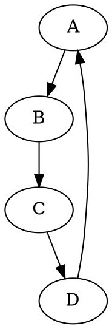
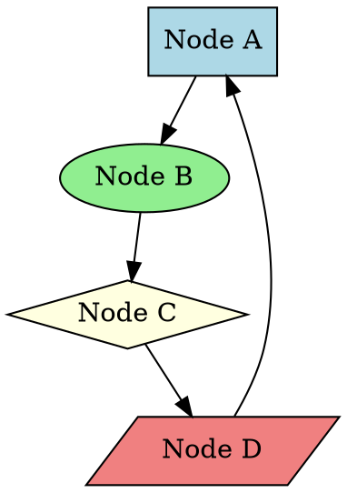
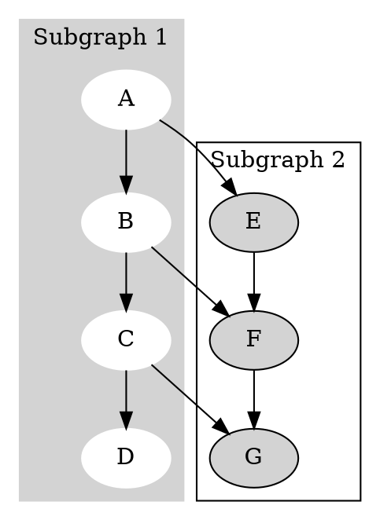
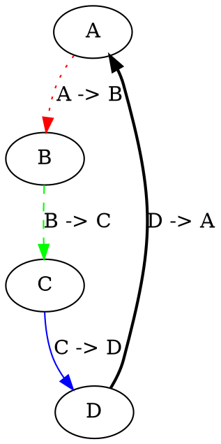
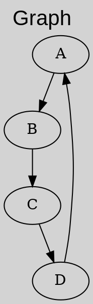
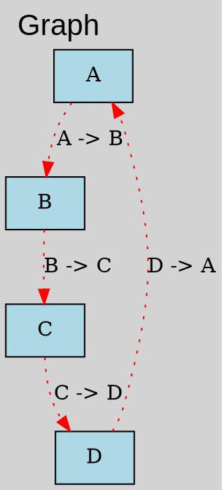
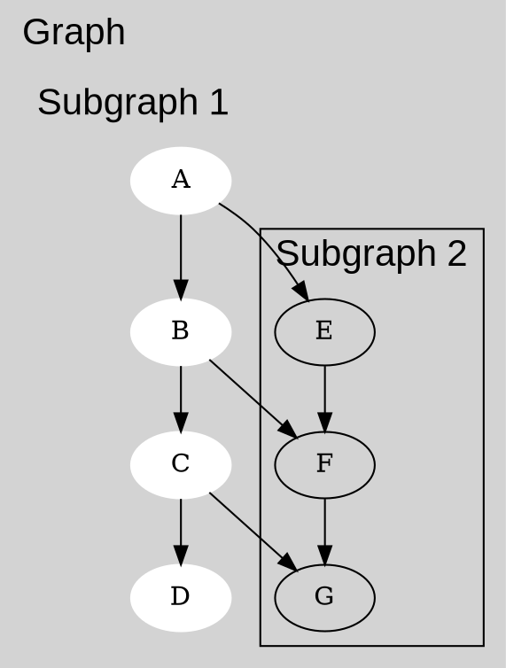
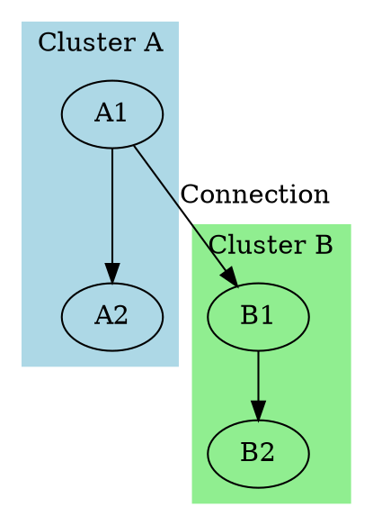
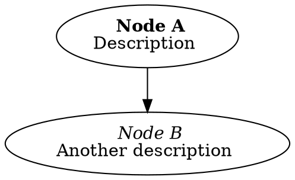

# Graphviz Tutorial

*Author: Dr. Francesco Garcia Luna*

---

## Index

1. [Installation](#1-installation)
2. [Usage](#2-usage)
3. [Examples](#3-examples)
    - [Simple graph](#simple-graph)
    - [Graph with attributes](#graph-with-attributes)
    - [Graph with subgraphs](#graph-with-subgraphs)
    - [Graph with edge attributes](#graph-with-edge-attributes)
    - [Graph with graph attributes](#graph-with-graph-attributes)
    - [Graph with edge and node attributes](#graph-with-edge-and-node-attributes)
    - [Graph with subgraph attributes](#graph-with-subgraph-attributes)

---

## 1. Installation

- Ubuntu: `sudo apt-get install graphviz`
- Windows: Download from [Graphviz](https://graphviz.gitlab.io/download/)
- Mac: `brew install graphviz`

## 2. Usage

1. Create a file with the `.dot` extension (e.g. `graph.dot`)
2. Write the Graphviz code in the `.dot` file
3. Compile the `.dot` file with the `dot` command from Graphviz
4. View the output file (e.g. `graph.png`)
5. Modify the `.dot` file and repeat steps 3 and 4

---

## 3. Examples

### Simple graph

- `digraph` indicates a directed graph.
- `->` indicates a directed edge.

### Graph with attributes

- `label` is the text displayed in the node.
    - You can use HTML to format the text.
    - Formatting options include: `<B>`, `<I>`, `<U>`, ``, ` `, ``, ``, `<TABLE>`, `<TR>`, `<TD>`.
- `shape` is the shape of the node.
    - Some shapes are: `box`, `ellipse`, `diamond`, `parallelogram`, `trapezium`, `triangle`, `pentagon`, `hexagon`, `septagon`, `octagon`, `doublecircle`, `doubleoctagon`, `tripleoctagon`, `invtriangle`, `invtrapezium`, `invhouse`, `Mdiamond`, `Msquare`, `Mcircle`, `rect`, `rectangle`, `square`, `circle`, `egg`, `oval`, `parallelogram`, `trapezium`, `house`, `hexagon`, `octagon`, `doublecircle`, `doubleoctagon`, `tripleoctagon`, `invtriangle`, `invtrapezium`, `invhouse`, `Mdiamond`, `Msquare`, `Mcircle`.
- `style` is the style of the node.
    - Some styles are: `filled`, `dotted`, `dashed`, `solid`, `bold`, `rounded`, `diagonals`, `filled,rounded`, `filled,dotted`, `filled,dashed`, `filled,solid`, `filled,bold`, `filled,diagonals`, `filled,rounded,dotted`, `filled,rounded,dashed`, `filled,rounded,solid`, `filled,rounded,bold`, `filled,rounded,diagonals`.
- `fillcolor` is the fill color of the node.
    - You can use English color names or RGB codes.

### Graph with subgraphs

- `subgraph` indicates a subgraph is being created.
- `cluster_0` and `cluster_1` are the names of the subgraphs.
- `color` is the color of the subgraph.
- `node` is the style of the nodes in the subgraph.

### Graph with edge attributes

- `label` is the text displayed on the edge.
- `color` is the color of the edge.
- `style` is the style of the edge.
    - Some styles are: `dotted`, `dashed`, `solid`, `bold`.

### Graph with graph attributes
    

- `label` is the text displayed on the graph.
- `labeljust` is the justification of the text.
    - `l` for left, `r` for right, `c` for center.
- `labelloc` is the location of the text.
    - `t` for top, `b` for bottom.
- `fontsize` is the font size.
- `fontname` is the font type.
- `bgcolor` is the background color of the graph.

### Graph with edge and node attributes

- `node` is the style of the nodes.
- `edge` is the style of the edges.

### Graph with subgraph attributes

- `graph` is the style of the graph.
- `subgraph` is the style of the subgraphs.

---

## Graph Theory Basics

Graphs are mathematical structures consisting of nodes (vertices) and edges. Directed graphs have edges with direction (arrows), while undirected graphs do not. Graphviz uses the DOT language to describe graphs, which can represent relationships, hierarchies, data flows, or networks. Key concepts include connectivity, cycles, and graph traversal algorithms.

## Advanced Examples

### Graph with Clusters and Colors

This example shows how to group nodes into visually distinct clusters.

### Graph with HTML Labels

HTML labels allow for rich formatting in node labels.

---

## Conclusion

This tutorial has introduced the basics of Graphviz for creating directed and undirected graphs. It covers installation, usage, and various examples with attributes for nodes, edges, graphs, and subgraphs. For more advanced features, refer to the official Graphviz documentation.