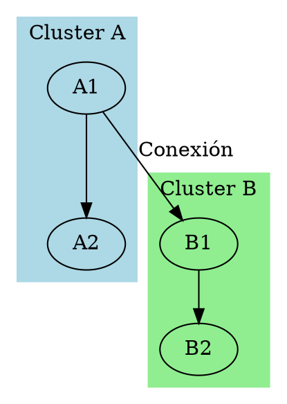
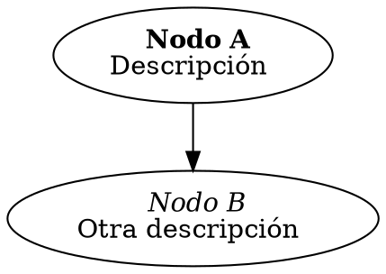

# Tutorial de Graphviz

*Autor: Dr. Francesco Garcia Luna*

---

## Indice

1. [Instalacion](#1-instalacion)
2. [Uso](#2-uso)
3. [Ejemplos](#3-ejemplos)
    - [Grafo simple](#grafo-simple)
    - [Grafo con atributos](#grafo-con-atributos)
    - [Grafo con subgrafos](#grafo-con-subgrafos)
    - [Grafo con atributos de aristas](#grafo-con-atributos-de-aristas)
    - [Grafo con atributos de grafo](#grafo-con-atributos-de-grafo)
    - [Grafo con atributos de aristas y nodos](#grafo-con-atributos-de-aristas-y-nodos)
    - [Grafo con atributos de subgrafos](#grafo-con-atributos-de-subgrafos)

---

## 1. Instalacion

- Ubuntu: `sudo apt-get install graphviz`
- Windows: Descargar de [Graphviz](https://graphviz.gitlab.io/download/)
- Mac: `brew install graphviz`

## 2. Uso

1. Crear un archivo con extension `.dot` (ej. `graph.dot`)
2. Escribir el codigo de Graphviz en el archivo `.dot`
3. Compilar el archivo `.dot` con el comando `dot` de Graphviz
4. Visualizar el archivo de salida (ej. `graph.png`)
5. Modificar el archivo `.dot` y repetir los pasos 3 y 4

---

## 3. Ejemplos

### Grafo simple

- `digraph` indica que es un grafo dirigido.
- `->` indica una arista dirigida.

### Grafo con atributos

- `label` es el texto que se muestra en el nodo.
    - Se puede usar HTML para dar formato al texto.
    - Entre las opciones de formato se encuentran: `<B>`, `<I>`, `<U>`, ``, ` `, ``, ``, `<TABLE>`, `<TR>`, `<TD>`.
- `shape` es la forma del nodo.
    - Algunas formas son: `box`, `ellipse`, `diamond`, `parallelogram`, `trapezium`, `triangle`, `pentagon`, `hexagon`, `septagon`, `octagon`, `doublecircle`, `doubleoctagon`, `tripleoctagon`, `invtriangle`, `invtrapezium`, `invhouse`, `Mdiamond`, `Msquare`, `Mcircle`, `rect`, `rectangle`, `square`, `circle`, `egg`, `oval`, `parallelogram`, `trapezium`, `house`, `hexagon`, `octagon`, `doublecircle`, `doubleoctagon`, `tripleoctagon`, `invtriangle`, `invtrapezium`, `invhouse`, `Mdiamond`, `Msquare`, `Mcircle`.
- `style` es el estilo del nodo.
    - Algunos estilos son: `filled`, `dotted`, `dashed`, `solid`, `bold`, `rounded`, `diagonals`, `filled,rounded`, `filled,dotted`, `filled,dashed`, `filled,solid`, `filled,bold`, `filled,diagonals`, `filled,rounded,dotted`, `filled,rounded,dashed`, `filled,rounded,solid`, `filled,rounded,bold`, `filled,rounded,diagonals`.
- `fillcolor` es el color de relleno del nodo.
    - Se puede usar nombres de colores en ingles o codigos RGB.

### Grafo con subgrafos

- `subgraph` indica que se esta creando un subgrafo.
- `cluster_0` y `cluster_1` son los nombres de los subgrafos.
- `color` es el color del subgrafo.
- `node` es el estilo de los nodos del subgrafo.

### Grafo con atributos de aristas

- `label` es el texto que se muestra en la arista.
- `color` es el color de la arista.
- `style` es el estilo de la arista.
    - Algunos estilos son: `dotted`, `dashed`, `solid`, `bold`.

### Grafo con atributos de grafo
    

- `label` es el texto que se muestra en el grafo.
- `labeljust` es la justificacion del texto.
    - `l` para izquierda, `r` para derecha, `c` para centro.
- `labelloc` es la ubicacion del texto.
    - `t` para arriba, `b` para abajo.
- `fontsize` es el tamaño de la fuente.
- `fontname` es el tipo de fuente.
- `bgcolor` es el color de fondo del grafo.

### Grafo con atributos de aristas y nodos

- `node` es el estilo de los nodos.
- `edge` es el estilo de las aristas.

### Grafo con atributos de subgrafos

- `graph` es el estilo del grafo.
- `subgraph` es el estilo de los subgrafos.

---

## Conceptos Básicos de Teoría de Grafos

Los grafos son estructuras matemáticas que consisten en nodos (vértices) y aristas. Los grafos dirigidos tienen aristas con dirección (flechas), mientras que los no dirigidos no. Graphviz usa el lenguaje DOT para describir grafos, que pueden representar relaciones, jerarquías, flujos de datos o redes. Conceptos clave incluyen conectividad, ciclos y algoritmos de recorrido de grafos.

## Ejemplos Avanzados

### Grafo con Clusters y Colores

Este ejemplo muestra cómo agrupar nodos en clusters visualmente distintos.

### Grafo con Etiquetas HTML

Las etiquetas HTML permiten formato rico en las etiquetas de nodos.

---

## Conclusión

Este tutorial ha introducido los conceptos básicos de Graphviz para crear grafos dirigidos y no dirigidos. Cubre la instalación, uso y varios ejemplos con atributos para nodos, aristas, grafos y subgrafos. Para características más avanzadas, consulta la documentación oficial de Graphviz.